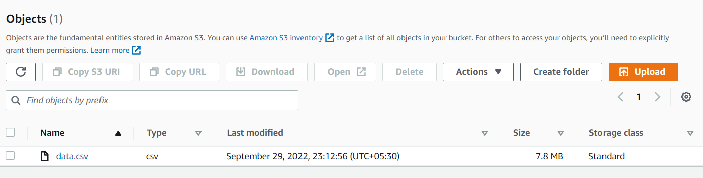

# SteelEye
Steel Eye Python assesment

As directed in the problem statement all the codefiles are modularised and
and has less cohesion in between modules...

The required data is uploaded to s3 bucket

Running driver.py file will get us the desired result...

Have tried to use less possible dependencies
